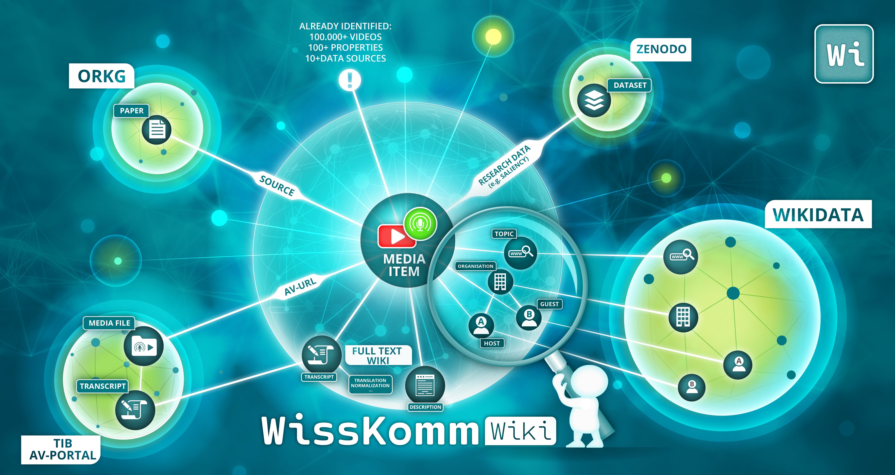

# scicom-wiki
A Digital Library to Support the Science Communication Knowledge Infrastructure for Videos and Podcasts

The SciCom Wiki is co-developed by [BorgNetzWerk - Gesellschaft zur Vernetzung Freien Wissens e.V. (Association for the Networking of Free Knowledge)](https://borgnetzwerk.org/), in collaboration with, among others, the Joint Lab [L3S](https://www.l3s.de/) & [TIB](https://www.tib.eu/) and the MediaWiki Community.

The Project "WissKomm Wiki" officially launches in 2026, developing the research prototype into a full service: Learn more by clicking on the image below or here: [borgnetzwerk.org/wisskomm-wiki-2026](https://borgnetzwerk.org/wisskomm-wiki-2026)

[](https://borgnetzwerk.org/wisskomm-wiki-2026)

## Software Components
### Integration & Import Microservice
[https://github.com/borgnetzwerk/integrationindri](https://github.com/borgnetzwerk/integrationindri)

### Media Search Microservice
[https://github.com/borgnetzwerk/searchsnail](https://github.com/borgnetzwerk/searchsnail)

### Web-Page
[https://github.com/borgnetzwerk/dashboardduck](https://github.com/borgnetzwerk/dashboardduck)

## Research
### Evaluation Survey
[https://github.com/borgnetzwerk/2025-scicom-ki-survey](https://github.com/borgnetzwerk/2025-scicom-ki-survey)

The software development and evaluation is described in detail in the Master's Thesis [Stehr 2025](https://doi.org/10.15488/18996):
```
@article{stehr_digitale_2025,
	title = {Eine digitale {Wissensinfrastruktur} zur {Bereitstellung} von {Informationen} über wissenschaftliche {Videos} und {Podcasts}},
	url = {https://repo.uni-hannover.de/handle/123456789/19141},
	doi = {10.15488/18996},
	language = {ger},
	urldate = {2025-04-29},
	author = {Stehr, Niklas},
	month = apr,
	year = {2025},
	note = {Publisher: Hannover : Gottfried Wilhelm Leibniz Universität},
}
```

### Citing SciCom Wiki
This work has been submitted to JCDL [[1]](https://doi.org/10.48550/arXiv.2511.09248), accepted, presented [[2]](https://github.com/borgnetzwerk/scicom-wiki/blob/main/SciCom%20Wiki.pdf), and is pending publication. If you want to cite SciCom Wiki:

```
@InProceedings{wittenborg_scicom_2025,
	author = {Wittenborg, Tim and Stehr, Niklas and Karras, Oliver and Auer, Sören},
	title = {{SciCom} {Wiki}: {A} {Digital} {Library} to {Support} the {Science} {Communication} {Knowledge} {Infrastructure} for {Videos} and {Podcasts}},
	shorttitle = {{SciCom} {Wiki}},
	year = {2025},
	keywords = {Computer Science - Digital Libraries, Computer Science - Multimedia},
	publisher = {arXiv},
	url = {http://arxiv.org/abs/2511.09248},
	doi = {10.48550/arXiv.2511.09248},
	note = {arXiv:2511.09248 [cs]},
}
```

## Contact
You can contact the authors directly or via email at _SciCom.Wiki at tib.eu_
